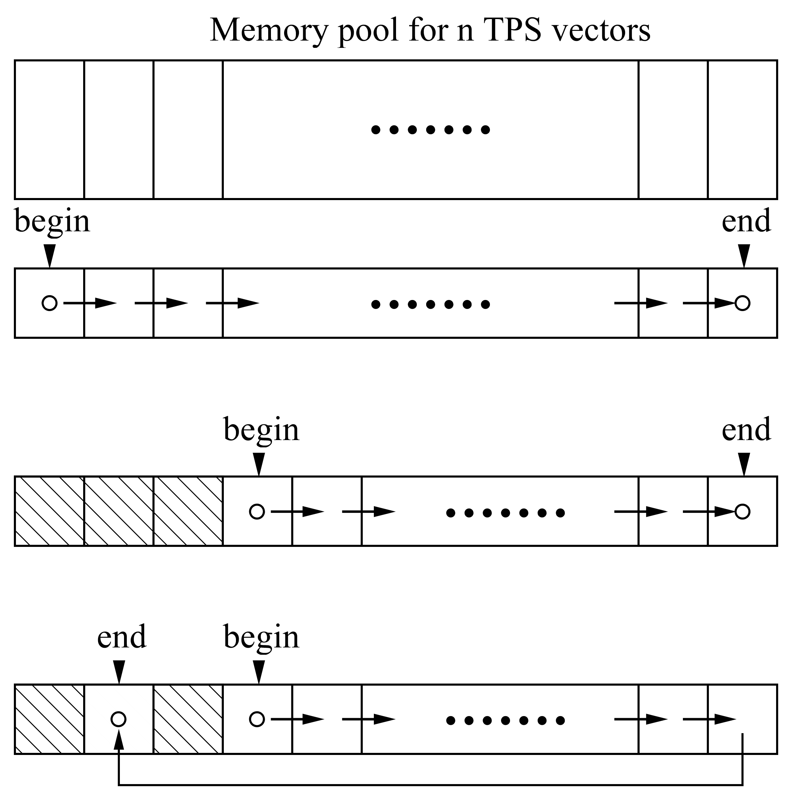

# cppTPSA/pyTPSA - C++ & Python TPSA Lib

[](https://github.com/zhanghe9704/tpsa/blob/master/LICENSE.md)

[](https://doi.org/10.21105/joss.04818)

## About this code

This code allows users to do computations using Truncated Power Series Algebra (TPSA) and/or Differential Algebra (DA) in C++ and Python 3.x environment.

For TPSA and DA, please refer to chapter 8 in [*Lecture Notes on Special Topics in Accelerator Physics*](http://inspirehep.net/record/595287/files/slac-pub-9574.pdf)  by  Prof. Alex Chao  and chapter 2 in [*Modern Map Methods in Particle Beam Physics*](http://bt.pa.msu.edu/cgi-bin/display.pl?name=AIEP108book) by Prof. Martin Berz. 

This code is developed based on Dr. Lingyun Yang's tpsa codes in C++ . His codes (tpsa.cpp and tpsa.h) are included in this repository. They are untouched, except for a few functions that are commented off and replaced by functions in tpsa_extend.cc. 

The major change is the memory management. The current memory management works in the following way. Before any TPSA/DA calculation, one needs to reserve the memory for $n$ TPS vector. A memory pool is allocated in the heap, which can be considered as $n$ slots, each for one TPS vector. A linked list is created to reference the  available (unused) slots. Two pointers point to the beginning and the end of the linked list respectively. When a new TPS vector is created, the first slot will be assigned to it and the beginning pointer points to the  following slot in the linked list. When a TPS vector goes out of its scope, the slot will be reset to empty and liked to the end of the list. The end pointer will be updated and point to the new end.  



A new data type DAVector is created as a wrapper of the TPS vector. The following mathematical operator and functions are overloaded for DAVector, so that a variable of DAVector type can be used as a intrinsic type in calculations. 

Math operator overloaded: (DA - DA vector, CD - complex DA vector)

| Left hand | Operator | Right hand |
|:---------:|:--------:|:----------:|
| DA/CD     | +        | DA/CD      |
| double    | +        | DA/CD      |
| DA/CD     | +        | double     |
|           | +        | DA/CD      |
| DA/CD     | -        | DA/CD      |
| DA/CD     | -        | double     |
| double    | -        | DA/CD      |
|           | -        | DA/CD      |
| DA/CD     | *        | DA/CD      |
| DA/CD     | *        | double     |
| double    | *        | DA/CD      |
| DA/CD     | /        | DA/CD      |
| DA/CD     | /        | double     |
| double    | /        | DA/CD      |
| DA/CD     | =        | DA/CD      |
| DA/CD     | =        | double     |
| DA/CD     | +=       | DA/CD      |
| DA/CD     | +=       | double     |
| DA/CD     | -=       | DA/CD      |
| DA/CD     | -=       | double     |
| DA/CD     | *=       | DA/CD      |
| DA/CD     | *=       | double     |
| DA/CD     | /=       | DA/CD      |
| DA/CD     | /=       | double     |

Math functions overloaded:

- sqrt
- exp
- log
- sin
- cos
- tan
- asin
- acos
- atan
- sinh
- cosh
- tanh
- pow
- abs
- erf (DA only)

Some test results for efficiency are presented in the following. They are done in a Windows 10 desktop with Intel Xeon (R) E5-1620 processor at 3.60 GHz. Table 1 shows the time cost for composition of one DA/TPS vector of six bases with six DA/TPS vectors.  First column shows the order of the vectors, second column the number of terms in each vector, third column the time using the DA data type with revised memory management, and the fourth column the time using the original code. Table 2 shows the time of composition of six DA vectors, each having six bases, with the other group of six DA vectors. The composition in group cost less time if compared with separate compositions. 

Table 1.  Time (in second) of composition 

| Order | No. of terms | DA                    | TPSA                 |
| ----- | ------------ | --------------------- | -------------------- |
| 2     | 28           | $7.57\times 10^{-6}$  | $6.25\times 10^{-6}$ |
| 4     | 210          | $7.50\times 10^{-4}$  | $1.44\times 10^{-2}$ |
| 6     | 924          | $4.48 \times 10^{-3}$ | $8.39\times 10^{-2}$ |
| 8     | 3003         | $9.90 \times 10^{-1}$ | $2.55$               |
| 10    | 8008         | $15.49$               | $44.60$              |

Table 2. Time (in second) of group composition 

| Order | DA                   |
| ----- | -------------------- |
| 2     | $1.51\times 10^{-5}$ |
| 4     | $1.04\times 10^{-3}$ |
| 6     | $4.42\times 10^{-2}$ |
| 8     | $1.05$               |
| 10    | $16.04$              |

More information on the code is available in [this doxygen document](https://zhanghe9704.github.io/tpsa/doc/doxygen/html/index.html).

## How to compile and use cppTPSA

You will need a C++ compiler that supports C++ 14 standard. (C++14 is needed to compile examples and tests. C++11 is enough to generate the libs.) There are three ways to use the code as follows:

* Download the source files. Include "tpsa_extend.h" and "da.h" in your project and compile. 

* The code is developed using Code::Blocks IDE. There are two C::B profiles under the cbp directory: tpsa_lib.cbp and tpsa_dll.cbp for static library and dynamic library respectively. The cbp files are tested in Windows 10 with gcc compiler. 

* You can also use cmake to compile the code into both a static library and a dynamic library. This has been tested in Ubuntu 20.04 (WSL2), and Ubuntu 22.04 (WSL2). 
  
  `cmake .` 
  `make`
  
  Here is an example of compiling the code under Ubuntu 22.04. 
  
  Assume I have cloned the codes to the following folder:
  
  $HOME/tpsa
  
  Inside the above folder, run:
  
  ```shell
  cmake .
  ```
  
  The Makefile will be generated. 
  
  Then run:
  
  ```shell
  make
  ```

  Both the static lib and the shared lib of tpsa will be generated. In the subfolder "lib", you can find  the following two files:

  libtpsa.a and libtpsa.so

### How to install cppTPSA

  The default installation path is /usr/local/lib. Use the following command to install to the default path:

```shell
sudo make install
```

  Both libs will be installed to /usr/local/lib and the header file, da.h, will be installed to /usr/local/include.

  To change the installation path, use the following command in cmake configuration:

```shell
cmake -DCMAKE_INSTALL_PREFIX=YOURPATH .
```

  The libs will be installed to YOURPATH/lib. 

### How to compile the exmaples and tests

  There are two ways to compile the examples. After installing the libs, you can run 

```shell
 cmake --build . --target build_examples
```

  The executable files will be generated inside the subfolder "examples". 

  Alternatively, you can jump into the examples folder and run make command:

```shell
cd examples
make
```

  Similarly, to compile the tests, you can run the following command in the root folder

```shell
cmake --build . --target build_tests
```

  or jump into the test folder to run

```shell
cd test
make
```

  To run the executables, make sure the libs can be found by the OS. If the libs are installed in the default director, run 

```shell
export LD_LIBRARY_PATH=$LD_LIBRARY_PATH:/usr/local/lib
```

  The tests depend on [*Catch2*]([GitHub - catchorg/Catch2: A modern, C++-native, test framework for unit-tests, TDD and BDD - using C++14, C++17 and later (C++11 support is in v2.x branch, and C++03 on the Catch1.x branch)](https://github.com/catchorg/Catch2)) version 2.3.16 , which is a header only test framework for C++.  Make sure you run the tests inside the test folder, otherwise some tests will be failed. 

**Known issues:**

When running tests in Linux (tested in Ubuntu 18.04/20.04/22.04), a "segmentation fault" error will be reported after passing all the tests. The does not happen when running the tests on Windows, and in Linux it does not happen when I used the lib in other programs in C++ or in Python.    

## How to compile and install pyTPSA

pyTPSA is the Python wrapper of cppTPSA. It generates a Python 3.x module for TPSA calculations. Source files of the wrapper, together with examples and tests, are in the subfolder "python-wrapper". Please see [**HERE**](https://zhanghe9704.github.io/tpsa/python-wrapper/readme.html) on how to compile, install, and use pyTPSA. 

## Guidelines for Third-Party Contributions, Issue Reporting, and Support

See [here](https://zhanghe9704.github.io/tpsa/contributing.html).

## Acknowledgement

Thanks to Dr. Lingyun Yang for providing his tpsa code.

**This work is supported by the U.S. Department of Energy, Office of Science, Office of Nuclear Physics under contract DE-AC05-06OR23177.**


## Contact

Contact the author by hezhang.AT.jlab.org. 
