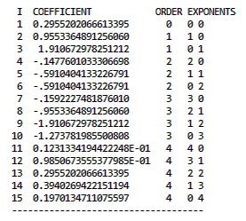
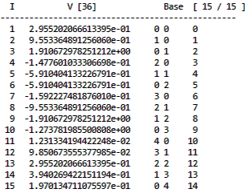

# Summary

The truncated power series algebra (TPSA), also referred to as differential algebra (DA), is a well-established and widely used method in particle accelerator physics and astronomy. The most straightforward usage of TPSA/DA is to calculate the Taylor expansion  of a given function at a specific point up to order $n$, based on which more sophisticated methods have been developed, *e.g.* symplectic tracking [@caprimap], normal form analysis [@monthnf], verified integration [@rdaint], global optimization [@go00], fast multipole method for pairwise interactions between particles [@FMMCPO2010]，*etc*.  The cppTPSA package implements the TPSA/DA in C++11 and provides the developers a convenient library to build the advanced TPSA/DA-based method. A Python 3 library, pyTPSA, has also been developed based on the C++ lib and is available in a separate GitHub repository [@pyTPSA].  

# Background

In the following, we give a very brief introduction on TPSA/DA from a practical perspective of computation. Please refer to [@AIEP108book] and [@chao2002lecture] for the complete theory with more details. 

The fundamental concept in DA is the DA vector. To make the concept easier to understand, we can take a DA vector as the Taylor expansion of a function at a specific point.  

Considering a function $f(\mathbf{x})$ and its Taylor expansion $f_{\mathrm{T}}(\mathbf{x}_0)$  at the point $\mathbf{x}_0$ up to the order $n$, we can define  an equivalence relation between the Taylor expansion and the DA vector as follows

$$ [f]_n = f_{\mathrm{T}}(\mathbf{x}_0) = \sum {C_{n_1,n_2, ..., n_v}} \cdot d_1^{n_1} \cdot \dots \cdot d_v^{n_v}, $$ where $\mathbf{x} = (x_1, x_2, \dots, x_v)$, and $n \ge n_1 + n_2 + \dots + n_v$. Here $d_i$ is a special number and it represents a small variance in $x_i$. Generally one can define a DA vector by directly setting values to respective terms, without defining the function $f$. The addition and multiplication of two DA vectors can be defined straightforwardly. To add two DA vectors, we simply add  the coefficients of the like terms. To multiply two DA vectors, we multiply each term in the first one with all the terms in the second one and combine like terms while ignoring all terms above order $n$. So given two DA vectors $[a]_n$ and $[b]_n$ and a scalar c, we have the following formulas:

\begin{eqnarray}
[a]_{n}+[b]_{n} & := & [a+b]_{n},\nonumber \\
c\cdot[a]_{n} & := & [c\cdot a]_{n},\label{eq:addmlt}\\
{}[a]_{n}\cdot[b]_{n} & := & [a\cdot b]_{n},\nonumber 
\end{eqnarray}

According to the fixed point theorem [@AIEP108book], the inverse of a DA vector that is not infinitely small can be calculated iteratively in a limit number of iterations. 

The derivation operator $\partial_v$ with respect to the $v^{\mathrm{th}}$ variable can be defined as 

$$ \partial_v[a]_n = \left[ \frac{\partial}{\partial x_v} a \right]_{n-1}, $$

which can be carried out term by term on $[a]_n$. The operator $\partial_v$ satisfies the chain rule:

$$ \partial_v([a]\cdot [b]) = [a]\cdot (\partial_v [b]) + (\partial_v [a])\cdot [b]. $$

The inverse operator $\partial^{-1}_v$ can also be defined and carried out easily in a term-by-term manner. Once the fundamental operators are defined, the DA vector can be used in calculations just as a number. 

# Statement of need

The TPSA/DA methods for particle beam dynamic analysis was developed in 1980s. The tools are available in several popular programs for particle accelerator design and simulations, *e.g.* COSY Infinity 9 [@COSYCAP04], MAD-X [@deniau2017mad], PTC [@forest2002introduction], *etc*. In recent years, the use of TPSA/DA has been extended in other fields, which motivates building TPSA/DA libraries in popular programming languages. The existing programs are not convenient for developers in other fields. MAD-X is specifically developed for the accelerator design and cannot be used as a general programming language. Although COSY Infinity can be used as a general programming languages, it lacks some convenient programming features in a modern language, such as C++ or Python. It also does not have abundant libraries and  a large supporting community. PTC includes a TPSA/DA library in Fortran 90 but it does not have a user-friendly interface. The TPSA/DA library in C++ is rare. DACE [@massari2018differential, @DACE] is one alternative. The DACE repository on GitHub had been created but no codes had been released when the author started to develop cppTPSA. Now DACE is available to the public. DACE provides the fundamental DA operations as well as some advanced algorithms based on DA but it has not supported the complex DA vectors, which is useful in the normal form analysis. To the best knowledge of the author, there is no other TPSA/DA library in Python 3. 

# Features

This library is composed of a C++ library that performs the TPSA/DA calculations and a Python wrapper (in a separate repository). Users can compile the source code into a static or shared library or generate a Python library for Python 3 environment.  The readme file in each repository describes how to compile the C++ library and the Python library respectively. 


The C++ library is based on Lingyun Yang's TPSA code, which was included in the previous versions of MAD-X. In the development, we try to make minimal changes on the original code, but had to revise or rewrite some functions for better efficiency and/or consistency.  One big change is the memory management. In Yang’s code, the pointers to all the DA vectors are stored in a vector. Each time a new DA vector is needed, the program will search in the vector to find the first empty pointer and allocate the memory. Once the DA vector is out of scope, the memory is freed. In this library, we allocate the memory pool for all DA vectors (number defined by the user) in the very beginning when we initialize the DA environment. The address for the slots, each for one DA vector, in the pool are saved in a linked-list. Whenever we need to create a new DA vector, we take out a slot from the beginning of the list. Whenever a DA vector goes out of the scope, its destructor will set all value in the slot to zero and put it back to the end of the list. The memory pool is managed simply by manipulating the two pointers that points to the beginning and the end of the list. In this way, the repetitive searching and allocation/deallocation operations are avoided and better efficiency can be achieved.


Some new features have been added, which are listed in the following. 

1. Add a DA vector data type and define the commonly used math operators for it, so that users can use a DA vector as simple as a normal number in calculations. 
2. Support the complex DA vector defined by the C++ complex template. 
3. More math functions are supported. (A list of the overloaded math functions can be found in the readme file of the repository.) 
4. Add new functions that perform the composition of (complex) DA vectors, which can carry out multiple compositions in a call. 
5. A Python wrapper is provided. 


The following C++ code shows an example of a simple TPSA/DA calculation. After initializing an environment that can contain at most 400 three dimensional DA vectors up to the 4-th order, two DA vectors x1 and x2 and a complex DA vector y1 are defined, some trigonometric functions are performed on them, and the results are output to the screen. 

```c++
    #include "da.h"
    da_init(4, 3, 400);
    DAVector x1, x2;
    x1 = da[0] + 2*da[1] + 3*da[2];
    x2 = sin(x1);
    x1 = cos(x1);
    auto y1 = x1 + x2*1i;
    std::cout<<x1<<x2<<std::endl;
    std::cout<<sin(y1)<<std::endl;
```


A Python example doing the same calculation is presented as follows. 

```python
    import tpsa
    tpsa.da_init(4, 3, 400)
    da = tpsa.base()
    x1 = da[0] + 2*da[1] + 3*da[2]
    x2 = tpsa.sin(x1)
    x1 = tpsa.cos(x1)
    y1 = tpsa.complex(x1, x2)
    print(x1)
    print(x2)
    print(tpsa.sin(y1))
```

More examples can be found in the respective repository. 


# Verification

This library has been verified with COSY Infinity 9.0. As an example, the outputs of calculating sin (0.3+da[0]+2×da[1]) up to the fourth order by both programs are presented in \autoref{fig:cosy} and  \autoref{fig:cpptpsa} respectively. \autoref{fig:cosy} shows the result by COSY Infinity, while \autoref{fig:cpptpsa} shows the result by cppTPSA. The two programs give out exactly the same result. Here we want to note (1) for some functions, *e.g.* arcsin, one may observe difference in the results at orders of $10^{-15}$ or $10^{-16}$, which is due to the different algorithms used in the calculation and is considered acceptable in practice and (2) the sequence of the terms may be different when outputting a DA vector from cppTPSA and from COSY Infinity. 






# Acknowledgements

The author would like to thank Dr. Lingyun Yang for providing his source code. 

This material is based upon work supported by the U.S. Department of Energy, Office of Science, Office of Nuclear Physics under contract DE-AC05-06OR23177.


# References

